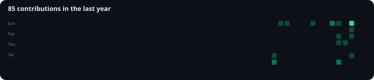

<a href="https://github.com/heyItsRocky">
  <picture>
    <source media="(prefers-color-scheme: dark)" srcset="./dark.svg">
    <source media="(prefers-color-scheme: light)" srcset="./light.svg">
    
  </picture>
</a>

<p align="center">
  <samp>building systems where software meets hardware.</samp>
</p>

<p align="center">
  <a href="https://github.com/heyItsRocky?tab=followers"></a>
  <a href="https://github.com/heyItsRocky?tab=repositories"></a>
</p>

---

## `whoami`

```text
Rakshith S. / heyItsRocky

CSE • IoT • Cybersecurity • AI

I build things that are meant to exist outside a tutorial.

→ cybersecurity systems
→ embedded & IoT platforms
→ offline-first systems
→ AI-assisted tools
→ Linux environments
→ hardware + software prototypes
→ hackathon projects that actually work
```

## `./currently-building`

| Project | What it is |
| --- | --- |
| **SENTINEL** | Raspberry Pi-based threat intelligence platform |
| **TrapBox** | Portable honeypot / deception system |
| **ECHO-PI** | Offline communication & education platform for disaster zones |
| **FarmShield** | AI-powered plant disease identification system |
| **VeriPass** | Digital Product Passport platform |
| **TRACE//MANTHAN** | OSINT-based CTF experience |

## `tech`

<p align="center">
  
</p>

<p align="center"><sub>Python · C/C++ · Linux · Bash · Git · FastAPI · React · Flutter · Raspberry Pi · ESP32 · Docker · AI/ML</sub></p>

## `github`

<p align="center">
  
  
</p>

<p align="center">
  
</p>

## `activity`

<p align="center">
  
</p>

## `connect`

<p align="center">
  <a href="https://github.com/heyItsRocky"></a>
  <a href="https://www.linkedin.com/"></a>
</p>

<p align="center"><samp>stay curious. build dangerous things responsibly.</samp></p>
